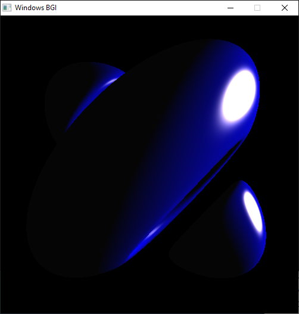

# graph-old-classes
Old project created while taking a Graphics class

The project was configured using Code::Blocks IDE, and winbgim.h library obtained from : https://codeblocks.codecutter.org/ 

Also you will need to download the WinBGIm libray from https://winbgim.codecutter.org/, follow the instructions on where to install the library.

This is the final result :

